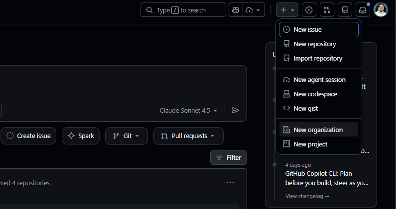
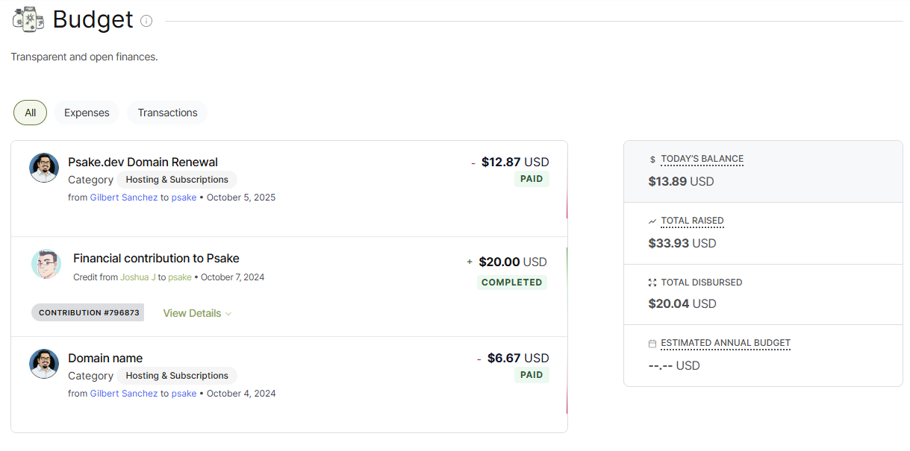
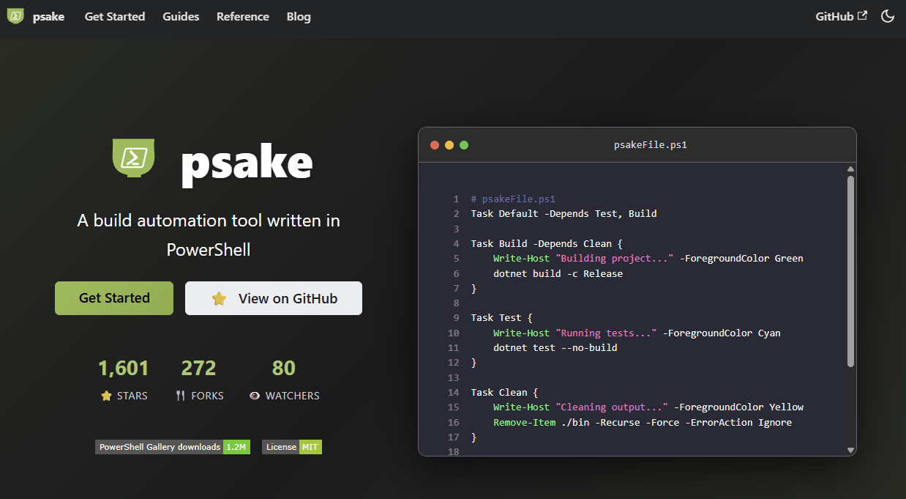

<!-- _class: title -->
# From Burnout To  Built-To-Last

## The Open Source Org Advantage

Gilbert Sanchez
@HeyItsGilbert

<!---

11:30am - 11:55am PDT
Goal: 5m at the end for Q&A

Description:
Open source is full of passion projects - but passion doesn't scale. Too often, a single maintainer carries the entire weight of a repo, and when life changes - new job, new priorities, or just plain burnout - the project fades. The bus factor is real, and it's not a fun way to run a community.There's a better way: run your projects as an organization. An org spreads responsibility, fosters new leaders, and makes your code resilient enough to outlast you. It's not just about sustainability - it's about building a community that thrives.And here's the kicker: running as an org also unlocks a treasure chest of free (for FOSS) tools and services. From free hosting and GitHub Copilot, to shared credentials and transparent funding, these benefits can supercharge your project without draining your wallet. I'll share lessons from joining the Psake org and starting PSInclusive, showing how orgs can create healthier teams, better tools, and projects that actually live on.

Key Take-Aways from your session:
- Understand why single-maintainer projects burn out—and how orgs prevent it.
- Learn how orgs foster collaboration, leadership, and sustainability.
- Discover free-for-FOSS services (hosting, Copilot, credential sharing, funding).
- See real-world examples from Psake and PSInclusive.
- Leave with practical steps to move your project from fragile to future-proof.
-->

---

<!-- _class: sponsors -->
<!-- _paginate: skip -->

# Thanks!

---
<!-- class: centered -->

# Hey! It's Gilbert

<!-- Author slide -->

- Staff Software Development Engineer
- ADHD 🌶️🧠
- [Links.GilbertSanchez.com](https://links.gilbertsanchez.com)

---

<!-- class: centered -->

# Our Goal

By the end of this talk you will understand:

1. Single maintainer pitfalls
2. Value of Organizations
3. Free services for your org

<!---

org including a mindset shift

--->

---

# Why do we do open source?

* Obligation
* Helpful
* Career
* ~~Ego~~
* ADHD

<!---

Show of hands, how many people have an open source project?
Contributed to open source projects?

--->

---

# Dopamine

1) Have an idea!
2) Solve a problem with code!
3) Share the code!
4) ...
5) Maintain the code?
6) MAINTAIN THE CODE?!?!
<!---
This turns into a job.
-->

---

# Burnout

A form of exhaustion caused by constantly feeling of being swamped.

* Emotional, mental, and physical fatigue.
* Recovering isn't straight forward.
* > Burnout…occurs because we're trying to solve the same problem over and over.
― Susan Scott

<!---
Not like any other type of injury.

On a "lighter note"
--->

---

# Bus Factor

<!--
For those who aren't familiar, the "bus factor" is the idea that if someone where inadvertently hit by a bus and passes away, then all the tribal knowledge would be lost.
--->

---

# Pitfalls & Red Flags

1. Burnout
2. Bus Factor
3. Spread too Thin
4. Not Interested in Maintaining

---
<!-- _class: no-background -->

<!-- _footer: Photo by Natalie Pedigo on Unsplash --->

# Value of Organizations

<!--
Photo by <a href="https://unsplash.com/@nataliepedigo?utm_source=unsplash&utm_medium=referral&utm_content=creditCopyText">Natalie Pedigo</a> on <a href="https://unsplash.com/photos/silhouette-of-people-standing-on-highland-during-golden-hours-wJK9eTiEZHY?utm_source=unsplash&utm_medium=referral&utm_content=creditCopyText">Unsplash</a>
      
-->

---

# Why Orgs?

1) Distribute responsibilities
2) Growth Opportunities
3) Soft skill career signal
4) Opportunity to work with people
5) Reduce the "bus factor"

---

<!------
You are now convinced.
--->

# Psake

Standing on the shoulder of giants.

1) Officially started in 2008
2) Migrated from single maintainer to Org in 2018
3) 72 Contributors

<!--
Started by James Kovacs

Learned about it via Stucco (Brandon Olin aka DevBlackOps)

Transition: My first project was documentation.
--->

---

<!-- _class: big-statement -->

# Free for FOSS

---

# GitHub obv...

---

## GitHub Copilot

> A free subscription for GitHub Copilot is available to verified students, teachers, and **maintainers of popular open-source repositories** on GitHub. If you meet the criteria as an open source maintainer, you will be automatically **notified when you visit the GitHub Copilot subscription page**. As a student, if you currently receive the GitHub Student Developer Pack, you will also be offered a free subscription when you visit the GitHub Copilot subscription page.

"Popular" seems to be subjective.

---

# Keys to the Castle

- Team Account
- Not associated with Commercial Activity
- One form!
- [1Password/for-open-source](https://github.com/1Password/for-open-source)

<!--
Previously using Keybase
All on Github
--->

---

# Funding: OpenCollective

<!---
First learned about it via Pester

"Financial toll"
---->

---

# Hosting: Netlify

- Open Source Initiative approved license
- Code of Conduct
- Link to them
- [opensource-form.netlify.com](https://opensource-form.netlify.com/)

---

---

<!--- _class: big-statement -->

# But Wait! There's more

---

## Developer Tools & IDEs

- **[JetBrains Open Source License](https://www.jetbrains.com/community/opensource/)** — Free access to all JetBrains IDEs (IntelliJ, WebStorm, Rider, etc.) for active OSS contributors

- **[GitHub Copilot Pro](https://docs.github.com/en/copilot/managing-copilot/managing-copilot-as-an-individual-subscriber/managing-your-github-copilot-pro-subscription/getting-free-access-to-copilot-pro-as-a-student-teacher-or-maintainer)** — Free for maintainers of popular open source repositories

---

## Hosting & Deployment

- **[Vercel OSS Program](https://vercel.com/open-source-program)** — $3,600/year in credits + partner perks

- **[GitLab for Open Source](https://about.gitlab.com/solutions/open-source/)** — Free GitLab Ultimate + 50,000 CI/CD compute min

- **[Docker Sponsored OSS](https://docs.docker.com/docker-hub/repos/manage/trusted-content/dsos-program/)** — Verified badges, analytics, unlimited image pulls

---

## CI/CD & Build

- **[CircleCI for Open Source](https://circleci.com/open-source/)** — Up to 400,000 credits/month for Linux/Arm/Docker builds

- **[SignPath Foundation](https://about.signpath.io/product/open-source)** — Free code signing certificates for OSS projects

---

## Security & Quality

- **[Sentry for Open Source](https://sentry.io/for/open-source/)** — Free error tracking & performance monitoring

- **[Snyk for Open Source](https://snyk.io/open-source/)** — Free security scanning for public repositories

- **[SonarCloud](https://www.sonarsource.com/plans-and-pricing/sonarcloud/)** — Free static code analysis for public repos (30+ languages)

---

## Documentation & Search

- **[Read the Docs](https://about.readthedocs.com/pricing/)** — Free hosting for open source documentation

- **[Algolia DocSearch](https://docsearch.algolia.com/docs/docsearch-program/)** — Free search for technical docs and blogs

---

## Communication & Collaboration

- **[Zulip Cloud](https://zulip.com/for/open-source/)** — Free Standard tier for open source projects

- **[Atlassian Community License](https://www.atlassian.com/software/views/open-source-license-request)** — Free Jira, Confluence, Trello, Bitbucket

---

## Localization

- **[Crowdin](https://crowdin.com/page/open-source-project-setup-request)** — Completely free for open source projects

- **[POEditor](https://poeditor.com/kb/open-source-localization)** — Free unlimited strings/languages for OSI-licensed projects

---

## Cloud Credits

- **[AWS Promotional Credits](https://aws.amazon.com/blogs/opensource/aws-promotional-credits-open-source-projects/)** — Credits for CI/CD, testing, artifact storage

- **[Microsoft Azure Credits](https://opensource.microsoft.com/azure-credits/)** — For development, testing, infrastructure

---

# Our Goal

You should understand:

1. Single maintainer pitfalls
2. Value of Organizations
3. Free services for your org

---

# Future Proof Checklist

* 🔲 Create the Organization
* 🔲 Invite Contributors
* 🔲 Outline & Understand roles
* 🔲 Look for Leadership Opportunities
* 🔲 Healthy project -> Good Community

<!---
It starts with a mind set shift.

A healthy project attracts community. Community 
--->

---
<!-- _class: title -->
# THANK YOU

## Feedback is a gift

Please review this session via the mobile app

Questions? Find me @heyitsgilbert

<!--
Target: 11:50a
Q&A for the last 5M
-->